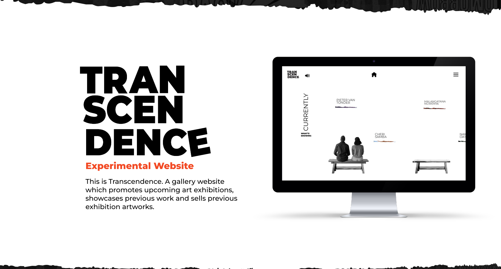
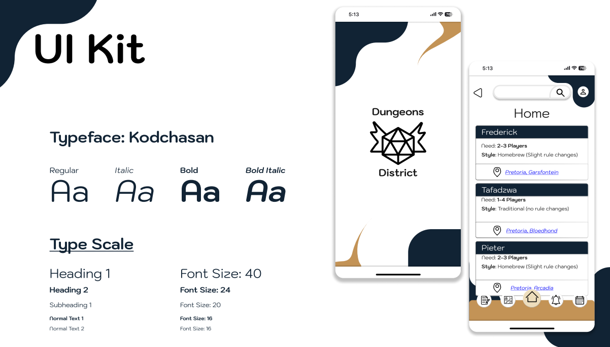
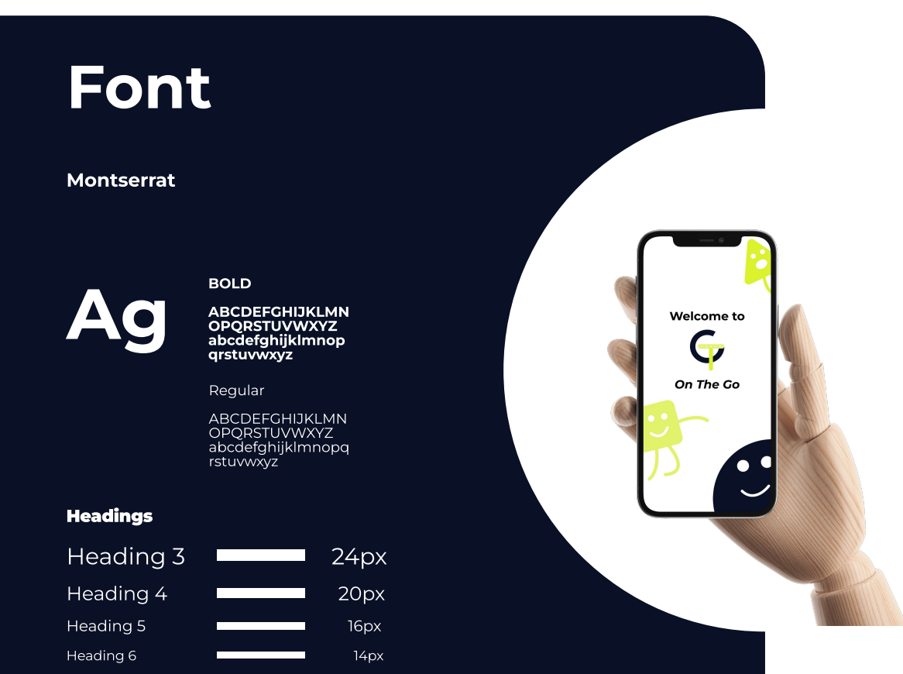
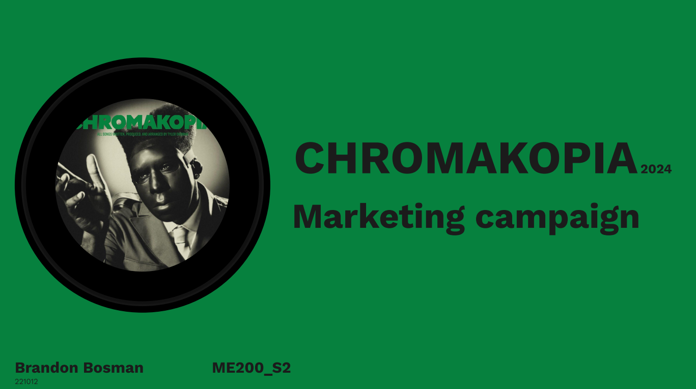

# Project Portfolio

This repository contains various design, marketing, and case study projects completed by Brandon Bosman. 
Each project is stored as a PDF file with relevant research, strategy, and visual materials.

## Contents

1. **Brand Research & Strategy**  
   *Description:* A comprehensive analysis of brand archetypes, brand personality, and tone of voice guidelines, with a focus on positioning and strategic objectives.  
   *File:* [Brand Research & Strategy.pdf](./BrandResearch&Strategy.pdf)  
   

2. **Case Study: Transcendence**  
   *Description:* A design challenge solution for an experimental online art gallery, offering virtual exhibitions, ticketing, and affordable replica artwork sales.  
   *File:* [Case Study.pdf](./CaseStudy.pdf)  
   

3. **Dungeons District App**  
   *Description:* A user-friendly app designed for Dungeons & Dragons players, helping with player order, scheduling, campaign discovery, and note management.  
   *File:* [DungeonsDistrict.pdf](./DungeonsDistrict.pdf)  
   

4. **On The Go App**  
   *Description:* A colour-blind-friendly ridesharing and safety app with visual, haptic, and audio feedback for safer driving and ride booking.  
   *File:* [OnTheGo.pdf](./OnTheGo.pdf)  
   

5. **Tyler The Creator: CHROMAKOPIA Marketing Analysis**  
   *Description:* An in-depth marketing case study analysing Tyler, The Creator’s campaign for CHROMAKOPIA, covering social media strategy, PR, events, and ROI.  
   *File:* [TylerTheCreatorShortMarketingAnalysis.pdf](./TylerTheCreatorShortMarketingAnalysis.pdf)  
   

© 2025 Brandon Bosman. All rights reserved.
